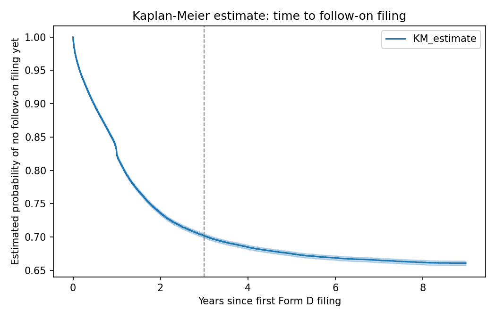
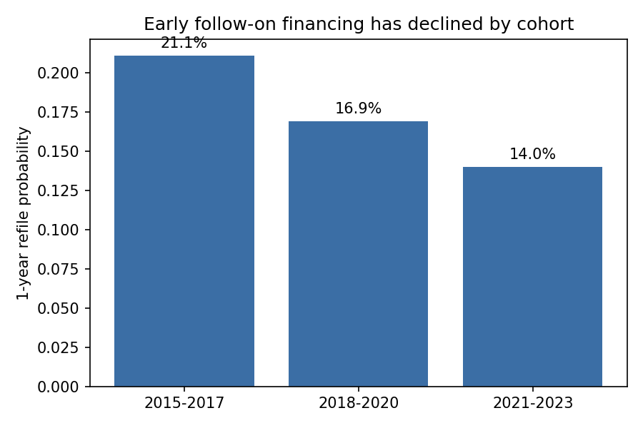

# private-markets-bias-toolkit


[](https://github.com/tulinette/private-markets-bias-toolkit/actions/workflows/tests.yml)


**Status:** complete (v0.1)

## Problem

Scoring models for private companies are usually trained on whichever companies happen to have a known outcome by the time you build the model. Newer companies haven't had time to reveal one yet, they just look "unresolved," not "failed." Training on that mixture as if it were the true outcome understates real-world risk, because it implicitly treats every company as if it had had the same amount of time to fail.

This project builds a naive scoring model on real SEC Form D data, shows the bias this creates, and corrects it with survival analysis instead of just dropping the ambiguous cases.

## Why this matters

Any model that scores private companies (or private funds' underlying portfolio companies) for credit, PE screening, or LP due diligence faces this same problem: the newest cohort in your dataset hasn't had time to fail yet, and a model blind to that will look more confident, and more validated, than it actually is. The censoring correction and the cohort-stability check here are the same two questions any private-markets model should be asked before it's trusted: is "unresolved" being treated as "resolved," and is the relationship being modeled stable across time, or is it quietly cohort-specific.

## Data

- Source: [SEC Form D structured data sets](https://www.sec.gov/structureddata/form-d-data-sets) (public, free, quarterly)
- Range: 2015 Q1 to 2023 Q4 (36 quarters, ~625MB, not committed, see `.gitignore`)
- 434,101 total filings / 222,847 unique companies (by CIK)
- 189,242 filings / ~105,000 companies after excluding pooled investment funds (funds re-file routinely for reasons unrelated to company survival, so they'd distort any "did this entity survive" question)

## What "survived" means here

A company's Form D filings are the only signal available: a second filing within 3 years of the first is read as still active/raising follow-on capital; no second filing is read as not observed to still be active. Framed this way, what looks at first like classic *survivorship bias* is more precisely **right-censoring**: many of the youngest companies in the dataset simply haven't had 3 years to prove anything either way, and treating their outcome as "known" understates uncertainty.

## Naive model vs. reality

A first-filing-only logistic regression (state, entity type, industry group, log offering amount) predicting 3-year survival, restricted to companies old enough to observe:

| Metric | Naive model | Majority-class baseline |
|---|---|---|
| Accuracy | 0.871 | 0.871 |
| AUC | 0.742 | 0.500 |

Accuracy alone makes the model look worthless: it ties the baseline exactly. AUC (threshold-independent) shows there's real signal in the features; accuracy was just the wrong metric for an imbalanced label.

## Bias correction: Kaplan-Meier

Dropping the not-yet-observable companies (the naive approach) gives a 3-year survival estimate of **34.8%**. Fitting a Kaplan-Meier estimator on the full panel (which correctly treats "not yet observed" as censored rather than excluded) gives **29.8%**, a **5.0 point** downward correction. The naive approach was systematically optimistic.



## Is the bias itself stable over time? (cohort check)

To check whether pooling all cohorts into one Kaplan-Meier curve is even valid, 1-year refiling hazard was compared across three first-filing cohorts:

| Cohort | 1-year refile probability |
|---|---|
| 2015–2017 | 21.1% |
| 2018–2020 | 16.9% |
| 2021–2023 | 14.0% |

The decline is real and monotonic; early-stage follow-on financing has gotten structurally less frequent over the period, not just noisier. Any model (naive or corrected) trained on pooled data is implicitly averaging over cohorts that don't behave the same way, which is a second, separate bias from the censoring one above.



## Structure

```
src/biastk/
  fetch_data.py           # download & extract SEC Form D quarterly zips
  load_panel.py           # join filings across the three source tables, flag funds
  survivorship.py         # naive observable/survived labels (right-censoring, unhandled)
  naive.py                # first-filing features + naive logistic regression
  survival_analysis.py    # Kaplan-Meier correction + cohort-stratified hazard check
tests/
```

## Tests

10 tests, 97% coverage (100% on `fetch_data.py`, `load_panel.py`, `survivorship.py`; 94–96% on `naive.py`/`survival_analysis.py`). The only gap is an `except ImportError:` fallback branch used only when a module is run standalone rather than imported as a package, unreachable under the test suite's normal import path by construction, not skipped for convenience.

```bash
python3 -m pytest tests/ --cov=biastk --cov-report=term-missing -v
```

## Setup

```bash
python3 -m venv .venv
source .venv/bin/activate
pip install -e ".[dev]"
python3 -m biastk.fetch_data
```

## Limitations & future work

- The "survived" label is a proxy (a second Form D filing), not a direct outcome like acquisition, shutdown, or IPO, since Form D doesn't report those.
- Only Reg D exempt offerings are covered; the corrected estimates describe this population, not all private companies.
- The cohort check confirms the hazard rate isn't stationary, but the current model doesn't yet condition on cohort; a natural next step is a time-varying or cohort-stratified hazard model instead of one pooled Kaplan-Meier curve.
- A natural extension: bridge this censoring-correction logic into [backtest-overfitting-lab](https://github.com/tulinette/backtest-overfitting-lab) to apply the same right-censoring lens to fund-performance/vintage comparisons, where the newest vintages face exactly the same problem.

## License

MIT, see [LICENSE](LICENSE).
